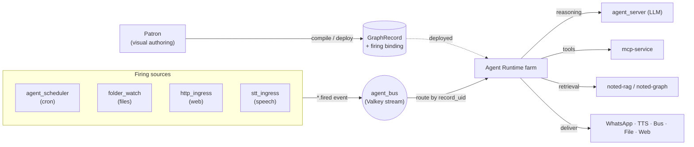

# Agent Runtime

[](LICENSE)

**The execution runtime for declaratively-defined agents — an "agent farm."**

One lean async process hosts many agents as dormant configuration records. Each is woken by an
event on the bus, runs as a transient, bounded task, and then disappears — delegating reasoning to
an LLM service, tools to MCP, retrieval to RAG, and delivery to a channel. Agents are **records, not
code**: you author a workflow visually, deploy it, and the farm runs it.

```
Author in Patron  →  compile to a GraphRecord  →  deploy  →  an event fires it  →  the farm runs it
```

---

## What it is

Agent Runtime is the **execute** stage of a small ecosystem:

> **Patron** (visual authoring) → **compiler** → **runtime DSL** → **Agent Runtime** (execute)

- You compose a node graph in **Patron** (a litegraph visual editor).
- Compilation lowers that composition to **one persisted `GraphRecord`** plus a **firing binding**
  (a scheduler cron job, or a file/web/speech ingress binding).
- The farm subscribes to the bus. When a `*.fired` event arrives, it routes by `record_uid` to the
  deployed graph and executes it — fanning values across wires, calling the LLM, tools, and
  retrieval as the graph dictates, and delivering the result to a channel.

Nothing about the visual editor reaches the runtime — the runtime consumes **only the compiled
graph**, so the authoring layer and the execution layer evolve independently.

---

## How it runs



**The firing contract.** Every `*.fired` event carries `payload.data = {record_uid, task}`:
`record_uid` routes the event to the right deployed graph; `task` is the workflow **seed** (the
schedule's message, the dropped file's contents, the web request body, or the transcribed speech).
The seed flows into the graph's entry node as the initial value.

**The graph model.** A `GraphRecord` is `{ uid, version, nodes[], edges[] }` with one entry node.
The executor walks from the entry, and:
- **fan-out** broadcasts one node's output to *every* outgoing wire,
- **fan-in** runs a node once per incoming message (per-message, no barrier).

A single Project deploys 1:1 to one `GraphRecord`; re-deploys are **idempotent** (same `uid`,
version-bumped, one firing binding).

---

## The block palette

Workflows are built from three families of blocks. RAG-pre and Guardrails are **configuration on the
Agent** that the compiler decomposes into their own graph nodes (`… → [rag] → agent → [guardrail] → …`).

| Family | Blocks |
|---|---|
| **Initiators** (fire the workflow) | Scheduled Trigger · File · Web · Speech-to-Text |
| **Processing** | Agent (persona · tools · RAG-pre · guardrails · skills · memory · loop) · Vector Database query · Graph Database query |
| **Destinations** (deliver the result) | WhatsApp · Text-to-Speech · Event Bus · File · Web |

Typical shapes that run today:

```
Scheduled Trigger → Agent(tools) → WhatsApp          # a daily digest
File drop → Agent → File                              # document intake (the agent reads the file's contents)
Web request → Agent → Web response                   # a webhook agent
Speech-to-Text → Agent → Text-to-Speech              # voice in, voice out
Vector Database → Agent → destination                # retrieve-then-reason
```

> `Data Transform`, `Workflow` (composite), `Branch`, and `Loop`-as-block are **planned** and disabled
> in the palette so they can't silently no-op at deploy.

---

## The flagship example — the News Agent

Every morning, curate headlines about a topic and post them to a WhatsApp chat:

```
Scheduled Trigger (cron 0 7)  →  Agent (news_curator persona + newsapi MCP tool)  →  WhatsApp
```

A scheduler cron fires a `schedule.fired` event → the farm routes it by `record_uid` → the agent
advertises its tools, calls `newsapi_search`, curates a short list → delivered to WhatsApp. One fire
per day, a bounded pipeline, then the task disappears.

---

## Project layout

```
src/agent_runtime/
├── app.py              # FastAPI app + lifespan (the farm boots here)
├── farm.py             # bus subscription; routes *.fired by record_uid
├── graph_executor.py   # GraphWorkflowExecutor: entry walk, fan-out / fan-in
├── graph_registry.py   # deployed GraphRecords, one JSON per Project uid
├── dsl_graph.py        # GraphRecord / GraphNode / GraphEdge model + validation
├── deploy.py           # deploy/undeploy: persist record + wire the firing binding
├── runner.py           # per-node handlers (agent, rag, vector/graph query, guardrail, destination)
├── nodes/              # brain (LLM), rag, guardrail, loop, delivery
├── composer/           # the Block model, catalog, and lowering (composition → GraphRecord)
├── admin.py            # admin API (deploy, channels, presets, tools)
└── config.py           # settings (service URLs, ports, thresholds)

documents/              # canonical specs — start with technical_architecture.md
```

**Start reading:** [`documents/technical_architecture.md`](documents/technical_architecture.md) →
[`documents/runtime_dsl_specification.md`](documents/runtime_dsl_specification.md) →
[`documents/use_cases.md`](documents/use_cases.md).

---

## Running it

Agent Runtime is a container that joins the shared `logus2k_network` and talks to its sibling
services by name over the bus and HTTP.

```bash
docker compose up -d --build
curl http://127.0.0.1:6817/health
```

The farm exposes a small FastAPI surface on **:6817** (health + admin/composer APIs; Patron and the
scheduler drive deploys through it).

**Constraints**
- **glibc base only** (`python:3.12-slim-bookworm`) — the Valkey client (`valkey-glide`) has no
  musl/alpine wheels.
- Join the external `logus2k_network`; the bus (`valkey-bus`) is owned by the agent_bus compose
  project — don't redeclare it.

---

## The ecosystem

| Repo | Role |
|---|---|
| **agent_runtime** (this) | Executes deployed graphs — the farm |
| **patron** | Visual authoring front-end; compiles compositions to graphs |
| **agent_bus** | Valkey-stream event bus + the shared envelope/firing-contract SDK |
| **agent_scheduler** | Cron firing source (schedule bindings) |
| **folder_watch / http_ingress / stt_ingress** | File / web / speech firing sources |
| **agent_server** | LLM reasoning (personas/presets) |
| **mcp-service** | Tool host (MCP) |
| **noted-rag / noted-graph** | Vector + knowledge-graph retrieval |
| **tts_server / stt_server** | Speech synthesis / recognition |

---

## Status

Implemented and running: the farm, the graph executor, deploy/undeploy with firing bindings for all
four initiator types, the Agent with tools/RAG-pre/guardrails, standalone Vector/Graph DB blocks, and
WhatsApp/TTS/Bus/File/Web destinations. The News Agent runs live on the scheduled path.

---

## License

Licensed under the **Apache License, Version 2.0** — see [LICENSE](LICENSE).

    Copyright 2026 António Cruz

    Licensed under the Apache License, Version 2.0 (the "License");
    you may not use this file except in compliance with the License.
    You may obtain a copy of the License at

        http://www.apache.org/licenses/LICENSE-2.0

    Unless required by applicable law or agreed to in writing, software
    distributed under the License is distributed on an "AS IS" BASIS,
    WITHOUT WARRANTIES OR CONDITIONS OF ANY KIND, either express or implied.
